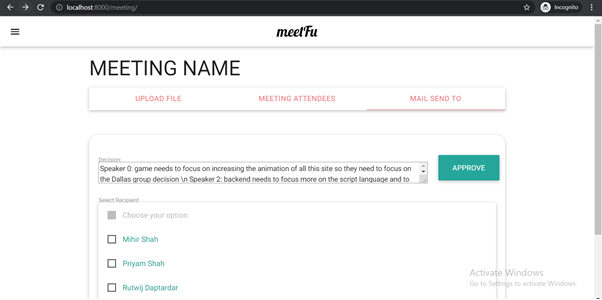

<h1 align="center">MEETING MINUTES</h1>

   

:heavy_check_mark: A Django website that aims to reduce time and resource constraint by automating meeting minutes collection and forwarding.

## Screenshots

                 
